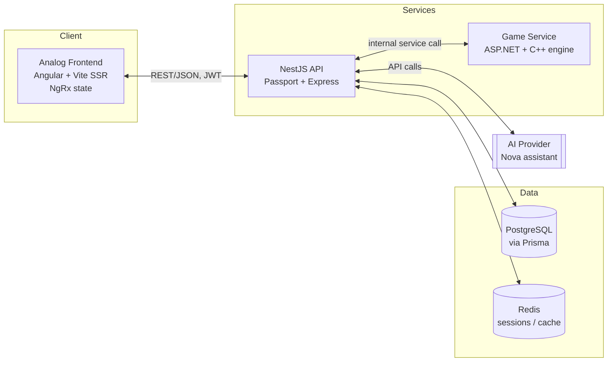

# Questly Architecture

Questly (internally "Nova") is a space/satellite-themed learning platform spanning K-12 through college level. It has four role-based panels (Admin, Author, Student, Educator), a custom lesson markup language, a gamified progress system, a scheduling calendar with audio "call mode" lessons, and a built-in AI assistant.

This document describes how the pieces fit together. See the root checklist for build sequencing; this doc is about shape, not order.

## System overview



## Repository layout

```
Questly/
  apps/
    analog/        # frontend: Angular + AnalogJS (Vite, SSR)
    analog-e2e/     # Playwright e2e tests for the frontend
    api/            # backend: NestJS
  game/             # ASP.NET service + C++ engine (own build pipeline; not Nx-managed)
  libs/
    shared-types/   # TS types shared between analog and api
```

Nx manages `apps/analog`, `apps/analog-e2e`, `apps/api`, and any TS libs. The game service uses its own toolchain (MSBuild/CMake) and is orchestrated from the root only via scripts, not Nx's task graph.

## Frontend — `apps/analog`

- **Framework**: AnalogJS on Angular, Vite build, SSR enabled (`main.server.ts`, `server.ts` already present in the scaffold).
- **Styling**: Tailwind CSS utility layer + a hand-authored SCSS design-tokens file (palette, spacing, type scale) as the single source of truth; Angular Material components re-themed from the same tokens rather than left at defaults.
- **State**: NgRx (`store`, `effects`, `entity`, `store-devtools`). Root state slices: `auth`, `user`, `progress`, `ui`. Components talk to a facade service per feature, never to the store directly.
- **Routing**: role-gated route trees under `/admin`, `/author`, `/student`, `/educator`, resolved after login from the user's role claim.
- **Panels**:
  - **Admin** — user management, content moderation, site config.
  - **Author** — lesson authoring UI built on the lesson markup language (below).
  - **Student** — dashboard, enrolled subjects, progress/EXP, calendar, call-mode playback.
  - **Educator** — class/roster management, grading, feedback tools.
- **Lesson markup language**: a custom syntax (superset of Markdown) rendered client-side, extending `marked` with block plugins for math (KaTeX/MathJax), molecule/science visualizations (WebGL-based viewer), code blocks (Prism, with an optional live-execution sandbox), and game-progress hooks. The Author panel edits this format directly or through an assisted editor.

## Backend API — `apps/api`

- **Framework**: NestJS on the Express platform adapter.
- **Auth**: Passport strategies — local (email/password) for login, JWT for session/bearer auth on subsequent requests. Role-based guards/decorators enforce the four panel roles at the route level.
- **Modules**: `AuthModule`, `UsersModule`, `LessonsModule`, `ProgressModule`, `CalendarModule`, `AiModule` (proxies to the AI provider), `GameBridgeModule` (talks to the game service).
- **Cross-cutting**: global `ValidationPipe`, exception filters, request logging middleware, versioned routes (`/api/v1`), Swagger/OpenAPI docs generated from decorators.
- **Contract boundary**: the API is the only writer of record for user, lesson, and progress data. The game service and AI provider integrate through it rather than touching the database directly, so Postgres stays a single source of truth.

## Data layer

- **PostgreSQL** (via Prisma ORM): `User`, `Role`, `Subject`, `Lesson`, `Progress`/`EXP`, `Goal`, `CalendarEvent`. Prisma migrations + a seed script populate dev data.
- **Redis**: session store for Passport, cache for rendered/parsed lesson content, rate limiting. Not used as a database of record.

## Game service — `game/`

- **Split**: C++ implements the core game/EXP-simulation engine; ASP.NET exposes it as a service (multiplayer state, EXP sync, leaderboard endpoints) that the NestJS API calls.
- **Communication**: NestJS `GameBridgeModule` → ASP.NET service over REST (or gRPC if request volume/latency later demands it). Exact protocol TBD before this module is built — see the transport question below.
- **Source of truth**: EXP/progress changes are written by the game service, then synced back to Postgres through the NestJS API — the game service never writes to Postgres directly, preserving the API as the single write boundary.

## AI assistant (Nova)

- Surfaced from any panel in the frontend as a chat/assist widget.
- `AiModule` in the API brokers requests to the LLM provider, injecting context: current lesson content, subject, and the requesting user's progress/role — so responses are grounded rather than generic.
- No direct frontend-to-LLM-provider calls; everything routes through the API so context injection, auth, and rate limiting stay centralized.

## Open questions to resolve before building the affected module

- **Game transport**: REST vs. gRPC vs. message queue between `api` and `game/` — decide once request patterns (turn-based vs. real-time) are clearer.
- **C++ ↔ ASP.NET interop**: native P/Invoke into the same process, or C++ as a separate process the ASP.NET service shells out to / talks to over a socket.
- **Lesson markup spec**: needs a written grammar before the Author panel or renderer can be built — currently described only by example content types (math, molecules, code).
- **Call-mode audio**: TTS-generated vs. pre-recorded lesson audio — affects whether `LessonsModule` needs an audio-generation pipeline.
